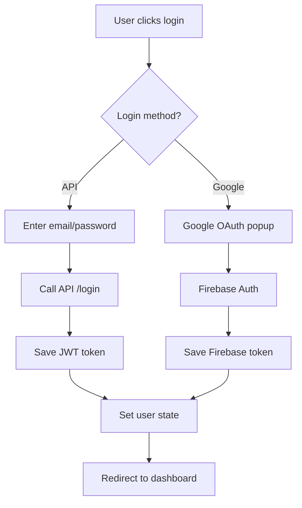

# 🔐 Login với API và Google Authentication

## Tính năng hiện có

✅ **Đăng nhập bằng API Backend**

- Kết nối với ASP.NET Core API
- JWT token authentication
- Validation form với Yup
- Error handling và toast notifications

✅ **Đăng nhập bằng Google**

- Firebase Google OAuth
- Popup authentication
- Tự động lưu user state

✅ **Modern UI/UX**

- Material-UI components
- Responsive design
- Loading states
- Gradient themes

## Cách sử dụng

### 1. Cấu hình Firebase (cho Google Sign-In)

Tạo file `.env.local` trong root project:

```env
VITE_FIREBASE_API_KEY=your-api-key-here
VITE_FIREBASE_AUTH_DOMAIN=your-project.firebaseapp.com
VITE_FIREBASE_PROJECT_ID=your-project-id
VITE_FIREBASE_STORAGE_BUCKET=your-project.appspot.com
VITE_FIREBASE_MESSAGING_SENDER_ID=123456789
VITE_FIREBASE_APP_ID=1:123456789:web:abcdef123456

VITE_API_BASE_URL=https://localhost:7265/api
```

### 2. Lấy Firebase Config

1. Truy cập [Firebase Console](https://console.firebase.google.com/)
2. Tạo project mới hoặc chọn project có sẵn
3. Vào **Project Settings** → **General** → **Your apps**
4. Click **Web app** icon và đăng ký app
5. Copy config values vào `.env.local`

### 3. Enable Google Sign-In

1. Trong Firebase Console, vào **Authentication**
2. Click tab **Sign-in method**
3. Enable **Google** provider
4. Thêm domain `localhost` vào **Authorized domains**

### 4. Backend API Requirements

Backend ASP.NET Core cần có:

```csharp
// CORS for React app
builder.Services.AddCors(options =>
{
    options.AddPolicy("ReactApp", policy =>
    {
        policy.WithOrigins("http://localhost:5173")
              .AllowAnyMethod()
              .AllowAnyHeader()
              .AllowCredentials();
    });
});

// Login endpoint
[HttpPost("login")]
public async Task<IActionResult> Login([FromBody] LoginRequest request)
{
    // Return format:
    return Ok(new {
        success = true,
        message = "Đăng nhập thành công",
        data = new {
            id = user.Id,
            email = user.Email,
            name = user.Name,
            token = jwtToken
        }
    });
}
```

## Testing

1. **API Login**: Nhập email/password và click "Đăng nhập"
2. **Google Login**: Click nút "Đăng nhập với Google"
3. **Check Authentication**: User state được lưu trong localStorage
4. **Navigation**: Auto redirect to `/dashboard` sau khi login thành công

## Troubleshooting

### Google Sign-In không hoạt động:

- Check Firebase config trong `.env.local`
- Verify Google provider đã enabled
- Check console log cho errors

### API Login lỗi 400:

- Verify backend đang chạy tại `https://localhost:7265`
- Check CORS settings
- Verify endpoint `/api/User/login` exist
- Check request/response format

### SSL Certificate Issues:

- Accept certificate tại `https://localhost:7265`
- Hoặc config backend để allow HTTP trong development

## Authentication Flow



## File Structure

```
src/
├── pages/
│   └── Login.tsx           # Main login component
├── services/
│   ├── AuthContext.tsx     # Auth state management
│   ├── apiService.ts       # API client
│   └── firebase.ts         # Firebase config
└── components/
    ├── Navigation.tsx      # Navigation with user menu
    └── ProtectedRoute.tsx  # Route protection
```

Enjoy your dual authentication system! 🚀
